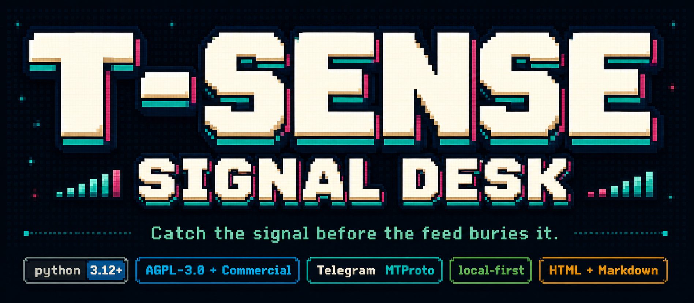
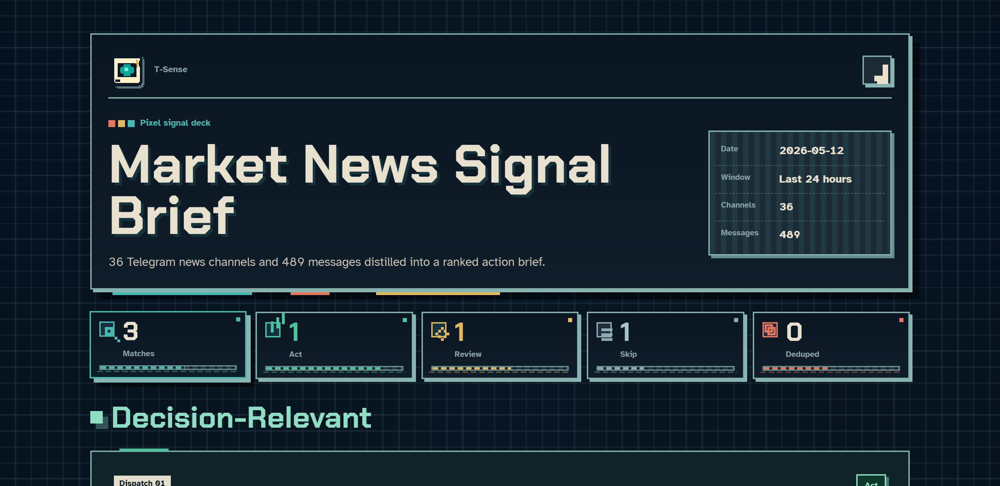
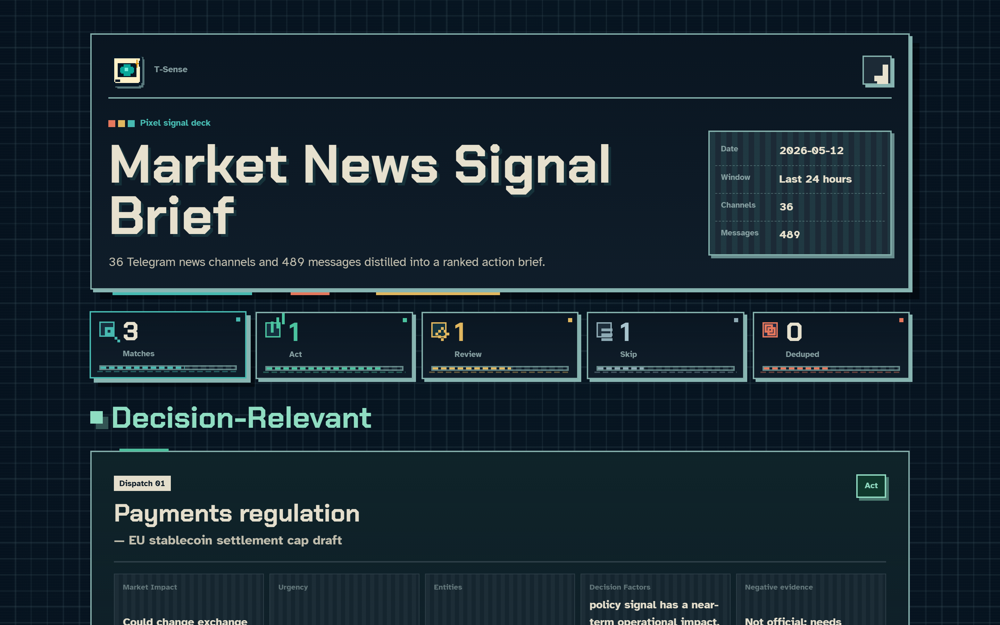

<div align="center">

<p>
  
</p>

<h3>Your next signal is already in the noise. T-Sense brings it to the surface.</h3>

<p>
  <a href="README.zh-CN.md"><strong>中文文档</strong></a>
  ·
  <a href="#demo"><strong>Demo</strong></a>
  ·
  <a href="#quick-start"><strong>Quick Start</strong></a>
  ·
  <a href="#output"><strong>Output</strong></a>
  ·
  <a href="#privacy-and-boundaries"><strong>Privacy</strong></a>
  ·
  <a href="docs/README.md"><strong>Docs</strong></a>
</p>

</div>

T-Sense is a local-first Telegram signal workflow. It reads channels you can
already access, scores messages against transparent Markdown profiles, and turns
noisy feeds into reviewable local reports.

This repository is the community open core: local scanner, profile-driven report
generation, optional OCR/STT helpers, HTML report templates, tests, and public
examples.

Private product layers are not included here: managed dashboards,
recommendation/join workflows, hosted services, commercial workflows, branded
experiences, private datasets, and packaged app distribution live
outside this source tree.

## At A Glance

| What this open core gives you | What stays out of scope |
| --- | --- |
| Local Telegram scanning through your own account access. | Hosted scraping, public message indexing, or a generic Telegram client. |
| Markdown profiles that keep matching rules visible and editable. | Hidden recommendation state that cannot be reviewed or reverted. |
| Deterministic Markdown/HTML reports with source links and run metadata. | Managed dashboards, recommendation engines, auto-join, invites, or folder workflows. |
| Optional LLM extraction and media OCR/STT with explicit provider config. | Managed commercial workflows, private services, or branded experiences. |

## Demo

The compressed demo video shows T-Sense turning noisy Telegram channels into a
ranked local signal brief.

<p align="center">
  <a href="docs/demo.mp4">
    
  </a>
</p>

<p align="center">
  <a href="docs/demo.mp4"><strong>Watch the demo video</strong></a>
</p>

## Quick Start

Requirements:

- Python 3.12+.
- Telegram API credentials from [my.telegram.org/apps](https://my.telegram.org/apps).
- An OpenAI-compatible API key only if you want AI extraction, summaries, or
  media OCR/STT.

```bash
git clone https://github.com/Sapientropic/t-sense-open-core.git
cd t-sense-open-core
python -m venv .venv
source .venv/bin/activate
python -m pip install -r requirements.txt -r requirements-llm.txt
cp config.example.toml config.toml
```

On Windows PowerShell:

```powershell
git clone https://github.com/Sapientropic/t-sense-open-core.git
cd t-sense-open-core
py -3.12 -m venv .venv
.\.venv\Scripts\Activate.ps1
python -m pip install -r requirements.txt -r requirements-llm.txt
Copy-Item config.example.toml config.toml
```

Fill `config.toml` with your Telegram `api_id` and `api_hash`. See
[docs/getting-api-credentials.md](docs/getting-api-credentials.md) if Telegram's
credential form is unreliable.

## First Scan

Create a channel list with one Telegram channel username per line:

```text
# channel_lists/my-channels.txt
bloomberg
reutersworldchannel
CoinDeskGlobal
```

Run a scan:

```bash
python scripts/scan.py channel_lists/my-channels.txt 24 --output-dir output
```

The scanner reads only channels your account can access. Generated scan files,
logs, sessions, and reports stay local and are ignored by git.

## Profiles

Profiles are Markdown files that define what counts as signal: topics, tracked
entities, keywords, rejection rules, output labels, and report preferences.

```bash
python scripts/report.py \
  --input output/scan_YYYYMMDD_HHMMSS.jsonl \
  --profile profiles/example-market-news.md \
  --output output/report.md
```

Run scan + report together:

```bash
python scripts/daily_report.py channel_lists/market-news.txt \
  --profile profiles/example-market-news.md \
  --html \
  --output-dir output
```

See [profiles/README.md](profiles/README.md) for starter profiles and custom
profile sections.

## Output

Every report can be rendered as standalone dark-theme HTML with cards, source
links, decision labels, diagnostics, and run metadata.

<table>
  <tr>
    <td width="50%">
      
    </td>
    <td width="50%">
      
    </td>
  </tr>
</table>

Generated artifacts stay out of Git:

| Path | Purpose |
| --- | --- |
| `output/scan_*.jsonl` | Local scan results. |
| `output/*.meta.json` | Scan metadata and incomplete-scan diagnostics. |
| `output/*.md` / `output/*.html` | Generated Markdown and HTML reports. |
| `*.session` / `.t-sense/` | Local Telegram/session/runtime state. |

## Privacy And Boundaries

- Telegram access uses MTProto through Telethon and only reads sources you can
  already access.
- Keep `config.toml`, sessions, `.env` files, generated reports, and private
  channel lists out of Git.
- Use `--redact-contact-info` before sending message text to an LLM provider
  when contact details are not needed.
- Media OCR/STT is off by default. When enabled, selected media may be sent to
  your configured provider.
- Read [docs/tos-risk-analysis.md](docs/tos-risk-analysis.md) before scanning
  large channel sets or automating scans.

## Development

```bash
python -m pip install -r requirements.txt -r requirements-llm.txt -r requirements-dev.txt
python -m ruff check .
python -m pytest -q
```

## Repository Map

| Path | Purpose |
| --- | --- |
| `scripts/` | Scanner, report generation, OCR/STT helpers, and the daily pipeline. |
| `profiles/` | Public Markdown profile examples. |
| `channel_lists/` | Safe example channel-list inputs. |
| `templates/` | HTML report templates and frontend assets. |
| `docs/` | Public setup, licensing, risk, screenshots, and demo material. |
| `tests/` | Public core regression tests. |

## Community / Commercial

The community open core is licensed under `AGPL-3.0-only`. It is meant for
personal use, research, self-hosting, open collaboration, and commercial use
where the AGPL obligations are acceptable.

Sapientropic may offer separate commercial products or licenses. Those offerings
are not granted by this repository.

Brand names and assets are not licensed under AGPL. Forks, redistributed builds,
hosted services, app bundles, and bots must follow [TRADEMARKS.md](TRADEMARKS.md).
Contributions must follow [CONTRIBUTING.md](CONTRIBUTING.md) and
[docs/licensing.md](docs/licensing.md).
